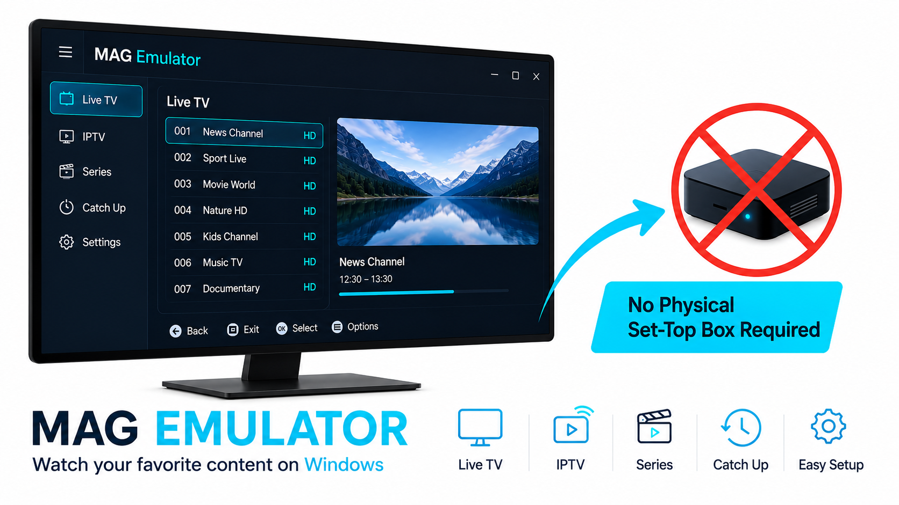

# QBox.MAG Emulator ShAN

<p align="center">
  
</p>


For Windows 10/11

Run your MAG/QBox IPTV service on Windows — no physical MAG set-top box required.

QBox.MAG Emulator ShAN is a MAG/QBox set-top box emulator designed to work with your existing **IPTV/OTT provider service**.

> **Note:** The application does not provide IPTV channels, content, playlists, or portal access. An active IPTV/OTT service and valid portal access from your IPTV provider are required.

## First launch

On the first run a setup screen appears:

1. Choose a language — **English** or **Русский**.
2. **Required** block (bold labels with `*`):
   - `MAC address *` — device MAC address;
   - `Serial number *` — serial number;
   - `Portal URL *` — portal address;
   - `Device model *` — device model (e.g. `MAG254`).
3. **Optional** block (regular font, already pre-filled with common MAG values —
   keep them or enter your own):
   - `Firmware version`;
   - `App version`;
   - `Server version`.
4. Click **Save and launch** — the settings are saved and the portal opens.

If you clear an optional version field, it is filled back with the standard
values on save (`0.2.18-r23`, `5.0.16`, `5.2.1`).

## settings.txt

Settings are stored in `settings.txt` next to the executable (or in the
AppData folder if the directory is not writable). You can edit the file
manually and restart the app:

```
# QBox.MAG Emulator ShAN settings
# Enter your device MAC address, serial number, portal URL and device model.
# Version fields are optional - left empty they use common device values.
mac_address = 00:11:22:33:44:55
serial_number = YOUR_SERIAL
portal_url = http://your-portal.example/index.html
device_model = MAG254
firmware_version = 0.2.18-r23
app_version = 5.0.16
server_version = 5.2.1
language = en
```

## Keys

### ⚙️ 1. System keys (app)

| Key | Action |
|---|---|
| `F8` | Restore sound (restart the media player, archive position is kept) |
| `F9` | Open the current stream in external VLC |
| `F11` | Toggle fullscreen / window |
| `F12` | Developer tools (DevTools) |
| `Ctrl+R` | Reload the portal |
| `Ctrl+Q` | Quit the app |

### 🧭 2. Navigation

| Key | Action |
|---|---|
| `↑` / `PageUp` / `Tab` | Up |
| `↓` / `PageDown` | Down |
| `←` | Left |
| `→` | Right |
| `Enter` | OK / Select |
| `Backspace` | Back |
| `Esc` | Exit |
| `0`–`9` | Enter channel number |

### ▶️ 3. Player control

| Key | Action |
|---|---|
| `Space` | Pause / Resume |
| `Alt` (right) | Stop, return to Live |
| `.` | Next program |
| `,` | Previous program |
| `;` | Fast rewind |
| `'` | Fast forward |
| `[` | Previous channel |
| `]` | Next channel |
| `I` | Info |
| `Enter` | Infobar / player menu |

### 🔊 4. Sound

| Key | Action |
|---|---|
| `=` / `-` / `` ` `` | Disabled — volume is forced to 100% |

### 🎨 5. Color buttons

| Key | Action |
|---|---|
| `F1` | Red — Now/Archive (TV), Channels (player) |
| `F2` | Green — Search / Favorites (VOD) |
| `F3` | Yellow — List view / Favorites |
| `F4` | Blue — TV guide (EPG) |

### 🖥 6. Extra functions

| Key | Action |
|---|---|
| `F10` | TV screen |
| `A` | Aspect ratio |
| `M` | Main menu |
| `U` | Power |
| `L` | Virtual keyboard |

### 🩺 7. Diagnostics

| Key | Action |
|---|---|
| `F12` → `window.__ppDiag()` | Codec and player state info |
| `F12` → Console | View `[pp]` logs |
| `F8` | Manual sound restore |
| `F9` | Check the stream via VLC |

## Gamepad and mouse wheel

**Mouse wheel:** in menus — up/down arrows; in the player — disabled (does not
switch channels).

**Xbox gamepad:**
- D-pad / left stick — navigation;
- `A` = OK, `B` = Back, `X` = Info, `Y` = Menu;
- `LB` / `RB` — channel −/+;
- `LT` / `RT` — red / blue;
- `Back` = Exit, `Start` = Menu;
- `L3` = Pause, `R3` = Stop;
- right stick — fast rewind / fast forward.


The portable executable is written to `x64/QBox.MAG Emulator ShAN.exe`.


## Donate

If you find this app useful, consider a donation:

| Coin | Address |
|---|---|
| BTC | `1E9jzHK9C3zDGGmiiHmcU4spjRNZgXeCJQ` |
| USDT (TRC20) | `TMkLqQDgArrPGzov7ZKQFGXbBYWnxqvHt2` |
